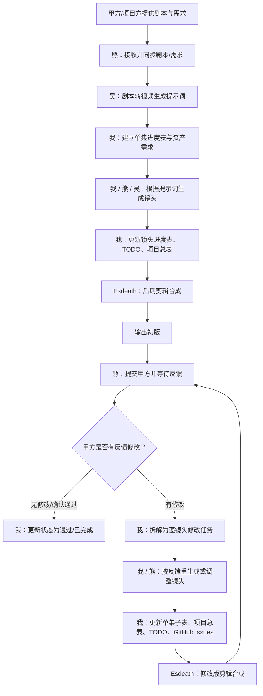
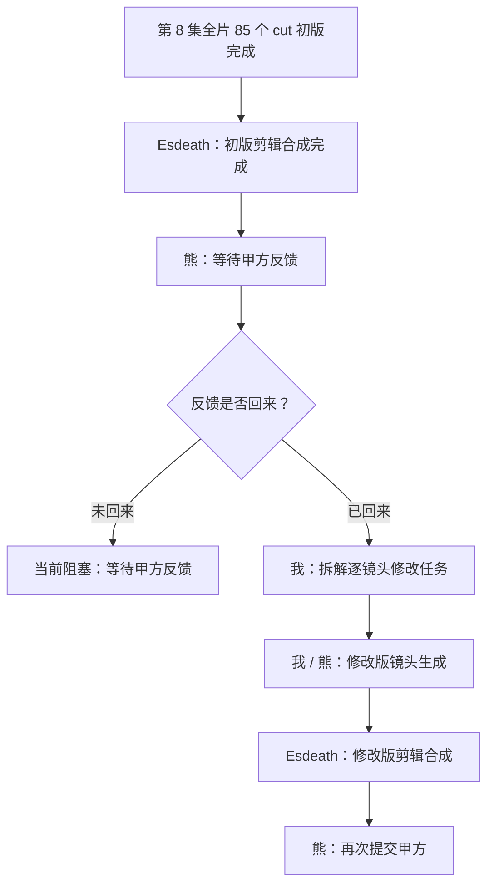
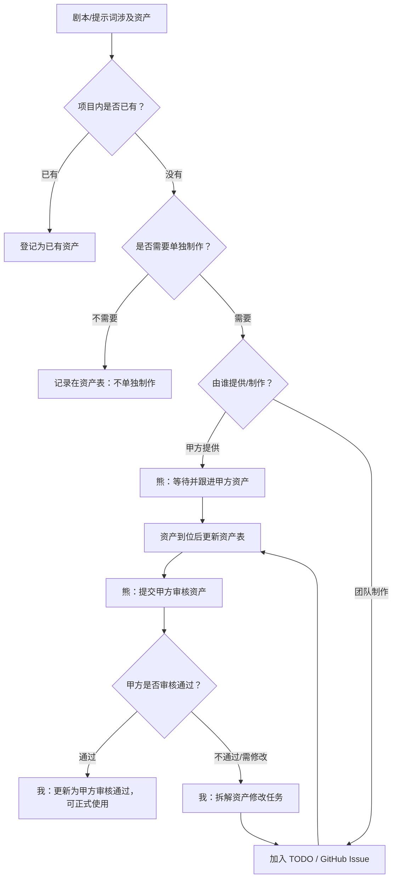

# 《叶罗丽好朋友》工作流程图

## 总流程

## 第 8 集当前状态

## 资产处理流程

## 责任边界

| 成员 | 负责环节 |
|---|---|
| 吴 | 剧本转视频生成提示词；镜头生成 |
| 我 | 镜头生成；进度表、TODO、GitHub Issues、流程管理 |
| 熊 | 镜头生成；甲方沟通；同步反馈、甲方资产和资产审核意见 |
| Esdeath | 后期剪辑合成 |

## 不纳入制作范围

| 项目 | 处理方式 |
|---|---|
| 音乐音效 | 不由团队制作；如甲方/后期已有素材，仅在合成阶段对接使用 |
